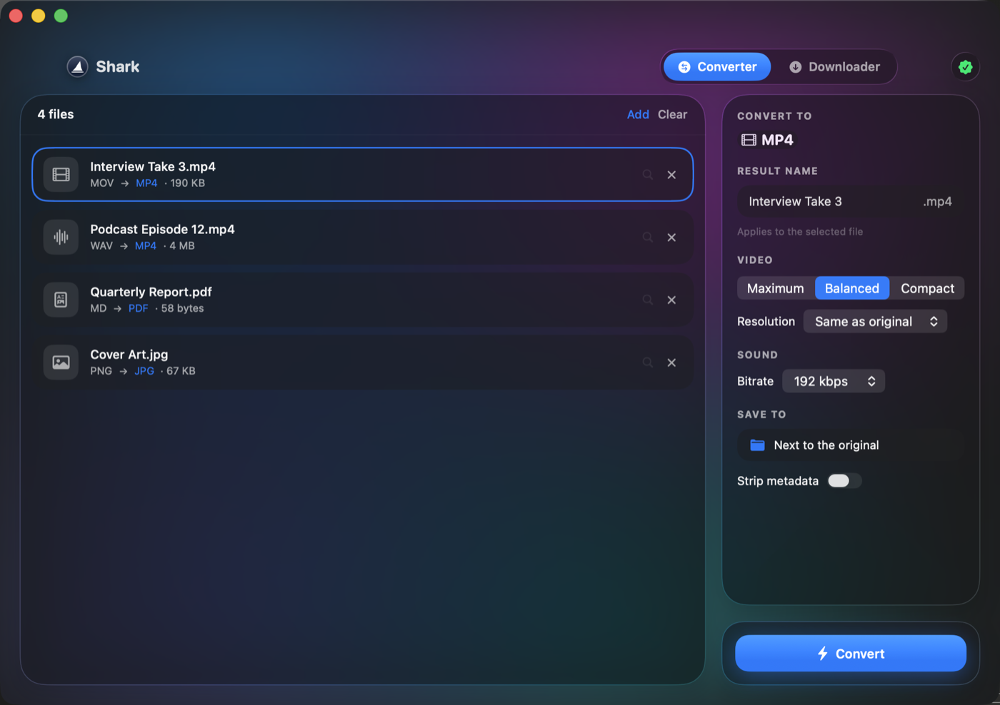
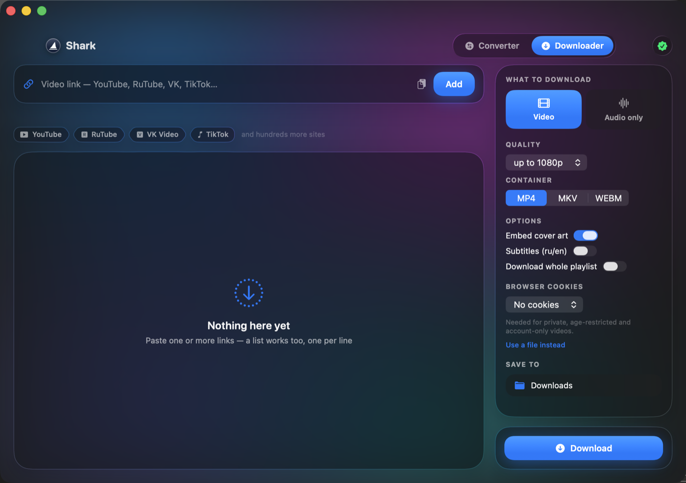

# Shark

A native macOS file converter and video downloader, written in SwiftUI with a Liquid Glass interface.

**Converts almost anything into almost anything.** Around 120 output formats across audio, video, images and documents, and far more on input — including camera RAW, Photoshop files and legacy office documents. Drop a mixed pile of files in at once: each one is routed to a sensible target on its own.

Everything runs locally. The finished `.app` carries its engines inside — no ffmpeg, no Python, no Homebrew required on the machine that runs it.



A mixed queue converts in one pass: video and audio to MP4, a Markdown report to PDF, artwork to JPG. Picking a format applies it only where it makes sense — choosing MP4 will not turn your documents into video.



Paste a link and the source is checked before you commit to it: platform, title and duration, or the reason it will not work.

## Install

**[⬇ Download Shark 1.0 (.dmg, 115 MB)](https://github.com/shineexxx/shark/releases/latest/download/Shark-1.0.dmg)**

Open the image and drag `Shark.app` onto the Applications shortcut inside. Then
read [First launch](#first-launch) below — macOS blocks the app once, and that
is expected.

Or install everything, including the command line tool, in one step:

```bash
brew tap shineexxx/tap
brew install --cask shark
```

That is the whole installation. It puts **Shark.app** into `/Applications`, links
the **`shark`** command so it works from any terminal, and registers the manual
page so `man shark` works too. The engines — ffmpeg, ffprobe, yt-dlp, deno — are
already inside the app; nothing else is downloaded or installed.

Updating later is `brew upgrade --cask shark`, and removing everything is
`brew uninstall --zap --cask shark`.

### First launch

Shark is signed ad-hoc rather than with a paid Apple Developer ID, so macOS
blocks the first launch. This is expected, it happens once, and it is not a sign
that anything is wrong:

1. Open Shark from Launchpad. macOS refuses and offers no way forward — that is
   normal.
2. Open **System Settings → Privacy & Security**, scroll to the bottom, and
   click **Open Anyway** next to Shark.
3. Open Shark again and confirm.

From then on it launches like any other app, and the `shark` command works too.

The honest version of what is happening: macOS marks anything downloaded from
the internet, and only lets marked software through if it has been notarised by
Apple. Notarisation requires a paid developer account. Your one confirmation in
Settings clears the mark, which is exactly what that button is for.

### Adding the command line tool to a manual install

The Homebrew cask links `shark` and its manual page for you. After installing
from the disk image, link them by hand:

```bash
sudo ln -sf /Applications/Shark.app/Contents/Helpers/shark /usr/local/bin/shark
```

All releases and their checksums are on the
[Releases page](https://github.com/shineexxx/shark/releases).

## Build from source

```bash
bash Scripts/build.sh
```

The script fetches the engines (first build only), compiles, draws the icon and assembles `build/Shark.app`.

```bash
open build/Shark.app
```

To install straight into `/Applications`:

```bash
INSTALL=1 bash Scripts/build.sh
```

Quick run without bundling: `swift run`.

**Requirements:** Swift 6 — Command Line Tools are enough, Xcode is not needed.

## Converting almost any format

Four engines sit behind one queue, and the right one is picked automatically from the pair of input and output formats. You never choose an engine — you choose a result.

**Audio → 15 formats**
`mp3` `m4a` `aac` `wav` `flac` `alac` `ogg` `opus` `wma` `aiff` `ac3` `amr` `caf` `mka` `mp2`

**Video → 15 formats**
`mp4` `mkv` `mov` `webm` `avi` `m4v` `flv` `wmv` `mpg` `mpeg` `ts` `ogv` `3gp` `ProRes` `gif`

**Images → 13 formats**
`jpg` `png` `heic` `webp` `tiff` `gif` `bmp` `avif` `jp2` `ico` `tga` `ppm` `pdf`

**Documents → 8 formats**
`pdf` `docx` `rtf` `html` `txt` `md` `png` `jpg`

Input accepts considerably more than output. Roughly 150 extensions are recognised, including things most converters refuse:

- **Camera RAW** — `cr2` `cr3` `nef` `arw` `dng` `orf` `rw2` `raf` `pef` `sr2`
- **Photoshop and friends** — `psd` `exr` `hdr` `dds` `jxl` `icns`
- **Legacy and office** — `doc` `docx` `odt` `rtfd` `webarchive` `epub`
- **Broadcast and DVD video** — `mxf` `dv` `vob` `m2ts` `mts` `y4m` `gxf`
- **Lossless and exotic audio** — `ape` `wv` `tta` `shn` `mpc` `dts` `aax`

### Cross-category routes

The interesting part is converting *between* categories, which most tools will not do at all:

| From | To | How |
|---|---|---|
| any video | mp3, m4a, flac … | audio extracted and re-encoded |
| any video | gif | palette generated per clip, so gradients stay clean |
| images | pdf | PDFKit |
| pdf | png, jpg, tiff | rasterised page by page — `name-01.png`, `name-02.png`, … |
| pdf | txt, rtf, html | text layer extracted |
| doc, docx, odt, html, md, txt | pdf, docx, rtf, html, txt, md | any-to-any across document formats |
| audio | mp4, mkv, mov | wrapped as a video container |

Options: video quality (CRF preset), resolution cap, audio bitrate, JPEG/HEIC quality, metadata stripping, output folder, and a per-file output name you can edit before or after the conversion.

`.ico` is written by hand rather than by an engine. ImageIO does not list `com.microsoft.ico` among the types it can write, and the ffmpeg ICO muxer only accepts a narrow set of sizes and pixel formats — it fails on an ordinary JPEG. The built-in writer embeds a full set of sizes (16 … 256) as PNG payloads, which is what Windows expects.

`.docx` output is produced by a minimal OOXML writer (paragraphs, bold, italic, underline, font size) packed with the system `/usr/bin/zip`. Rich formatting from the source is simplified — a deliberate trade for not depending on Word or LibreOffice.

### Where files can be dropped

- **Into the window** — the left panel of the converter.
- **Onto the Dock icon** — files join the queue of the window that is already open. The scene is declared as `Window`, not `WindowGroup`: a group spawned a new window for every file opened, so dropping onto the Dock kept multiplying windows.
- **Onto the menu bar icon** — the fin next to the clock. Click opens the window, Control-click opens a menu.

`Info.plist` declares the document type as `public.item`, the root of the type hierarchy, so any file or folder is accepted. The handler rank is `Alternate` so Shark never steals files from the apps that normally own them.

If the menu bar icon is not visible, a menu bar manager (Ice, Bartender and friends) is hiding it, or the notch pushed it off. The item is created and working either way; it has an `autosaveName`, so once dragged into place with Cmd held, its position sticks.

## Downloading from 1,700+ sources

The engine is yt-dlp, and the copy bundled with Shark ships **1,752 extractors** — that is the number the binary itself reports, not a marketing round-up:

```bash
shark --list-sources          # all 1,752
shark sources youtube         # 21 of them handle YouTube alone
```

An extractor is the parsing code for one site: where the stream URLs hide on the page, which qualities exist, where the title and thumbnail live. A single site usually needs several — one for a video, one for a playlist, one for a channel — so the count of distinct services is smaller than 1,752, but still in the many hundreds.

What that covers, sampled from the real list:

| | |
|---|---|
| **Video hosting** | YouTube, Vimeo, Dailymotion, RuTube, VK Video, Twitch |
| **Social** | Instagram (stories and tags too), Facebook (including Reels), Twitter, Reddit, TikTok |
| **Music** | SoundCloud, Bandcamp — albums and artist pages included |
| **Broadcasters** | BBC with iPlayer, ARTE, and dozens of public broadcasters across Europe and Asia |
| **Learning and subscriptions** | Coursera, TED, Nebula, Patreon |

The rest of the list is news sites, podcast platforms, sports services, archives, university video libraries and regional hosts from all over the world — most of the 1,752 are niche names you have never heard of.

Shark contains **no per-site code**. Every link goes through the same call, and yt-dlp picks the extractor by domain. When nothing matches, a generic extractor still tries to find media on the page — so a link can work even if its site is not on any list.

The flip side: extractors break. Sites change their markup, and a given one can stop working until yt-dlp is updated. The list marks known breakage — `instagram:user` was flagged as broken when this was written. That is exactly why Settings has a one-click yt-dlp update.

### Options

- Video capped at 480p … 2160p or "best", in mp4 / mkv / webm.
- Audio only: mp3, m4a, opus, flac, wav.
- Whole playlists, embedded cover art, ru/en subtitles.
- Cookies from Safari, Chrome, Firefox or Edge, or a `cookies.txt` file.
- Paste one link or a list, one per line. Title and duration are resolved automatically.

### Link checking

Paste a link and, after a 700 ms debounce, a status line appears under the field: the platform, the video title and its duration — or the reason it will not work. The check uses the same cookies and the same JS runtime as the real download, otherwise it would report failures that downloading would not hit.

The lookup is not wasted: if you press **Add** the result is reused, so the queue is filled without a second network round trip. If you press **Add** while the check is still running, the check is handed over to the queue row and finishes there instead of being cancelled and restarted.

### Notes from testing against live platforms

| Platform | State |
|---|---|
| RuTube | works out of the box |
| VK Video | works out of the box, serves up to 1080p |
| YouTube | needs cookies — anonymous requests get "Sign in to confirm you're not a bot" |
| TikTok | IP-dependent; some addresses are refused with "Your IP address is blocked" |

Both limits are platform policy, not app behaviour.

YouTube also needs a JavaScript runtime: stream URLs are delivered encrypted and yt-dlp has to execute the site's own JS to decipher them. Shark bundles `deno` for this. Without it part of the formats stay invisible. This is the single reason the bundle is ~200 MB instead of ~70 MB.

**Safari cookies require Full Disk Access** — the cookie file lives in a protected container and macOS refuses to read it otherwise. The app detects that specific failure and offers a button straight to the right settings pane. Firefox needs no permission at all, and a `cookies.txt` file avoids the question entirely.

Only download what you have the right to: your own uploads, freely licensed material, or content the rights holder permits you to download. The terms of each platform are your responsibility.

## Command line

`shark` ships inside the app and is linked automatically by the Homebrew cask —
the same engines, from a terminal.

```bash
shark c clip.mov --to mp4 --quality high
shark c *.heic --to jpg --image-quality 90 --out ~/Pictures
shark c doc.docx --to pdf --name report
shark download <url> --quality 1080
shark download <url> --audio mp3 --cookies firefox
shark formats
shark sources youtube
shark info clip.mov
shark man
```

`c` is a short alias for `convert` — the command you type most often should be
one character, not seven. Everything else about it is identical.

### Manual

```bash
shark man
```

opens the page from inside the bundle, so it works even before anything is
linked. `man shark` works too — the Homebrew cask registers the page for you.

If you installed by hand rather than through Homebrew, point `man` at the
bundled page by adding one line to `~/.zshrc`:

```bash
export MANPATH="$MANPATH:/Applications/Shark.app/Contents/Resources/man"
```

Result paths go to stdout, progress goes to stderr, so `shark convert *.wav --to mp3 > done.txt` yields a clean list of paths ready for further processing. The progress bar is drawn only when stderr is a terminal.

Exit codes: `0` success, `1` some files failed, `2` bad arguments, `3` a required engine is missing. Unknown options are rejected rather than silently ignored — a typo in a flag is an error, not a silent change in behaviour.

There is no separate CLI build. It is the same binary invoked under the name `shark`; it picks the mode from its own name and the first argument. Conversion in the terminal and in the window therefore cannot drift apart — the code is literally the same.

The symlink lives in `Contents/Helpers` rather than next to `Shark` in `Contents/MacOS`: the macOS filesystem is case-insensitive, so a file named `shark` would overwrite `Shark`.

## Settings

**General** — interface language (System / English / Русский), launch at login, keep running when the window is closed, menu bar icon.

Closing the window with the red button drops the app out of the Dock and leaves it in the menu bar; while a window is open the Dock icon is always present. Background mode forces the menu bar icon on — an app with no window and no icon would be unreachable.

**Conversion** — default output folder, default video quality and audio bitrate, metadata stripping, overwrite behaviour, reveal in Finder / sound / notification when the queue finishes.

**Downloads** — default download folder.

**Engines** — status and versions of ffmpeg, ffprobe, yt-dlp and deno, plus a one-click yt-dlp update.

### Updating engines

Sites keep changing, so yt-dlp goes stale faster than everything else. The **Update yt-dlp** button downloads the current release into Application Support rather than into the bundle: editing bundle contents breaks its signature, and the update would be lost on every reinstall.

Engine lookup therefore checks Application Support **first**, treating the bundled binary as the baseline that an update overrides. The download is staged, de-quarantined, ad-hoc signed and executed once before it replaces anything — a truncated download must not leave the app without a working yt-dlp. A **Revert** button restores the bundled version.

## Localisation

The interface ships in English and Russian and follows the system language unless told otherwise.

Translations live in a Swift table keyed by the English string itself, so an untranslated string degrades into meaningful English rather than into an identifier. Standard menus (File, Edit, Window, Help) are drawn by AppKit, which needs `en.lproj` and `ru.lproj` present in the bundle and `CFBundleLocalizations` declared — the build script creates both.

Changing the language in Settings rebuilds the interface immediately; the system menu titles follow after a restart, since AppKit reads them once at launch.

## Project layout

```
Sources/Shark/
├── SharkApp.swift              entry point, window, menu commands
├── main.swift                  routes GUI / CLI / selftest / icon modes
├── Core/
│   ├── ProcessRunner.swift     runs ffmpeg and yt-dlp, streams output line by line
│   ├── Tools.swift             engine lookup: updates → bundle → system
│   ├── DownloadRequest.swift   shared yt-dlp argument building for window and CLI
│   ├── EngineUpdater.swift     yt-dlp updates without a rebuild
│   ├── AppSettings.swift       single source of truth for settings
│   ├── Localization.swift      language selection and the translation table
│   ├── IconFactory.swift       draws AppIcon.icns from the same geometry as the logo
│   ├── SelfTest.swift          headless engine verification
│   └── Formats.swift           format catalogue and file type detection
├── Convert/
│   ├── ConversionEngine.swift  picks an engine for the input/output pair
│   ├── FFmpegConverter.swift   audio, video, exotic image formats
│   ├── ImageConverter.swift    ImageIO
│   ├── IcoWriter.swift         hand-written multi-size .ico
│   ├── DocumentConverter.swift PDFKit, CoreText, minimal OOXML writer
│   ├── ConvertOptions.swift    quality settings
│   ├── ConvertModel.swift      queue and state
│   └── ConvertView.swift       converter screen
├── Download/
│   ├── DownloadModel.swift     download queue, link checking
│   └── DownloadView.swift      downloader screen
├── CLI/
│   └── SharkCLI.swift          terminal mode of the same binary
└── Design/
    ├── Glass.swift             Liquid Glass with a material fallback
    ├── FinMark.swift           the fin mark: logo, icon, menu bar
    ├── MenuBarItem.swift       status item and file drops onto it
    ├── SettingsView.swift      settings window
    └── RootView.swift          shell, tabs, engine check screen
```

The fin is drawn once in a normalised 100 × 100 space (`FinMark.swift`) and reused everywhere: header logo, menu bar glyph and app icon. The silhouette cannot drift between them.

## Icon

The app draws its own icon; no image file is stored in the repository:

```bash
./build/Shark.app/Contents/MacOS/Shark --make-icon Resources/AppIcon.icns
```

It renders every size up to 1024×1024 through the system `iconutil` and drops a PNG next to it for inspection. `Scripts/build.sh` runs this on every build.

To use your own artwork, place `Resources/AppIcon.icns` yourself and remove the icon step from `Scripts/build.sh`.

## Self-test

```bash
./build/Shark.app/Contents/MacOS/Shark --selftest
```

Runs 31 real conversions across images, documents, audio and video on generated files and prints a report. No interface is opened, which makes it a fast check after touching the engines.

## Notes on packaging

The app is ad-hoc signed and runs unsandboxed: it launches bundled binaries and writes wherever the user points it.

If the engines are missing the app says so and offers two ways out — rebuild with `Scripts/build.sh`, or drop `ffmpeg`, `ffprobe`, `yt-dlp` into `~/Library/Application Support/Shark/Tools/`.

Liquid Glass is used on macOS 26; on macOS 14 and 15 the interface falls back to `.ultraThinMaterial` with the same layout.
